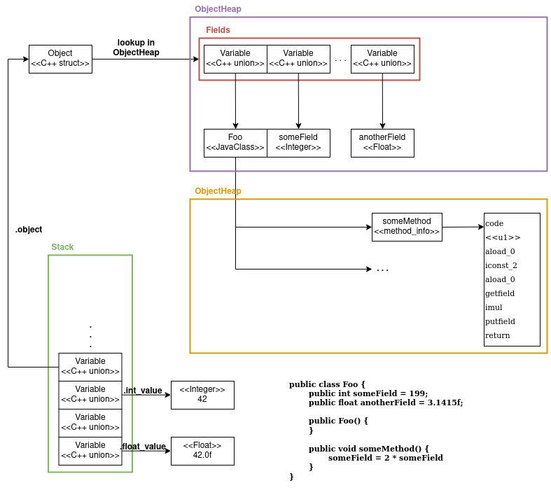

# Coldspot

## About

What was intended as a very simple and short weekend project turned out to be significantly harder and more complicated. The goal was to implement a very simple JVM based solely on the [Oracle specification](https://docs.oracle.com/javase/specs/jvms/se14/html/index.html).

The most time-consuming part was writing a class loader that correctly reads in a **.class** file. In the state right now, the VM loads in a **.class** file and executes the main function of the class. After execution, it prints out the value remaining on top of the stack. No function calls or object creation is supported right now. Additionally, garbage is not collected and there are various memory leaks. I just wanted to have a result as fast as possible.

This will change in the future, when i find the time to implement (some) missing components.





## Object Management

When objects are created, then space is allocated in the ```ObjectHeap``` and a reference to
this allocated space is returned in form of ```Object```. The reserved memory in the ```ObjectHeap``` represents the fields
of the object, where the first field points to the class from which the object is constructed.

The ```Object``` struct is lightweight and therefore copying them around in the JVM is not
very expensive (although better approaches exist).

```c++
struct Object {
    void* heap_ptr;
    u1 type;
};
```

## Stack

The stack is an array of ```Variable``` unions. The variable union has the form:

```c++
union Variable {
    u1 char_value;
    u2 short_value;
    u4 int_value;
    f4 float_value;
    
    void* ptrValue;
    Object object;
};
```

Depending on the type of the variable, the respective elements of the union is set or retrieved.


## Usage

```
$ make
$ /bin/main <<MY_CLASS>>.class
```

As an example you can use the class file defined by **Test.java**:

```
public class Test {

    int some_field;

    public static void main() {
        int a = 2;
        int b = 2 * a;
        int c = a + b;
        int d =  a * b * c;
        int e = d - 6;          // 42
    }

    static int mul(int a, int b) {
        return a * b;
    }

    static int add(int c, int d) {
        return c + d;
    }
}
```

which yields:

```
$ javac Test.java
$ /bin/main Test.class
Size of constant pool 18
Method name <init>
Method name main
Method name mul
Method name add
Top of stack 42
```